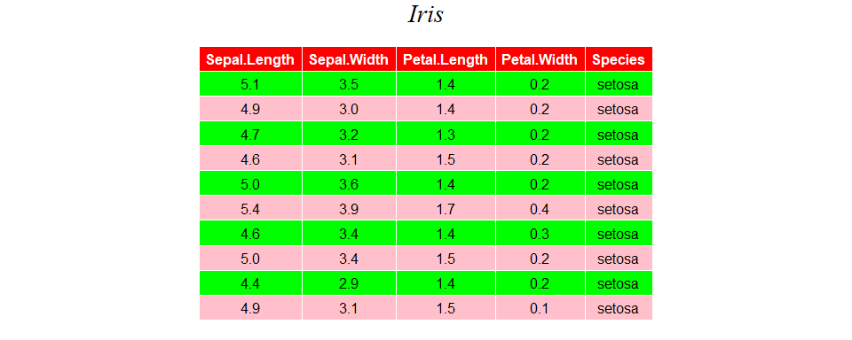

Homework 08: Making a shiny app
================
**For details:**

[my code](https://github.com/STAT545-UBC-students/hw08-Sukeysun/blob/master/iris/app.R)

[my app URL](https://sukeysun.shinyapps.io/iris/)

-   [Introduction to the data frame :smile:](#introduction-to-the-data-frame-smile)
    -   [Description](#description)
    -   [Usage](#usage)
-   [My shinny app](#my-shinny-app)
    -   [Outlook of my app](#outlook-of-my-app)
    -   [Features](#features)
-   [Features in CLUSTER](#features-in-cluster)
-   [Features in IRIS DATA](#features-in-iris-data)

Introduction to the data frame :smile:
--------------------------------------

### Description

In this homework, I used the iris data frame. This famous (Fisher's or Anderson's) iris data set gives the measurements in centimeters of the variables sepal length and width and petal length and width, respectively, for 50 flowers from each of 3 species of iris. The species are Iris setosa, versicolor, and virginica.

### Usage

We can have a quick look of the data in R by using `iris` 

My shinny app
-------------

### Outlook of my app

|                                                        Outlook 1                                                        |                                                        Outlook 2                                                        |
|:-----------------------------------------------------------------------------------------------------------------------:|:-----------------------------------------------------------------------------------------------------------------------:|
|  |  |

### Features

There are two separate tabs in my app. One is CLUSTER and the other is IRIS DATA. Features in each sidebar are different except the 'STAT 545' picture.

Features in CLUSTER
-------------------

I used K-means to cluster iris data set. Under this tab, you can choose the X and Y variable to see the clustering result. And the cluser count ranges from 3 to 9.

Features in IRIS DATA
---------------------

In this tabs, you can interface with the iris data:

-   Select
    -   You can select or deselect all rows
    -   You can select some specific rows you like and the selected row number is shown in the sidebar.
-   Choose columns
        you can select which columns you would like to see in the table
-   Highlight the selected column 
        When you put the mouse in a selected column, this column will be highlight.
-   Download data

